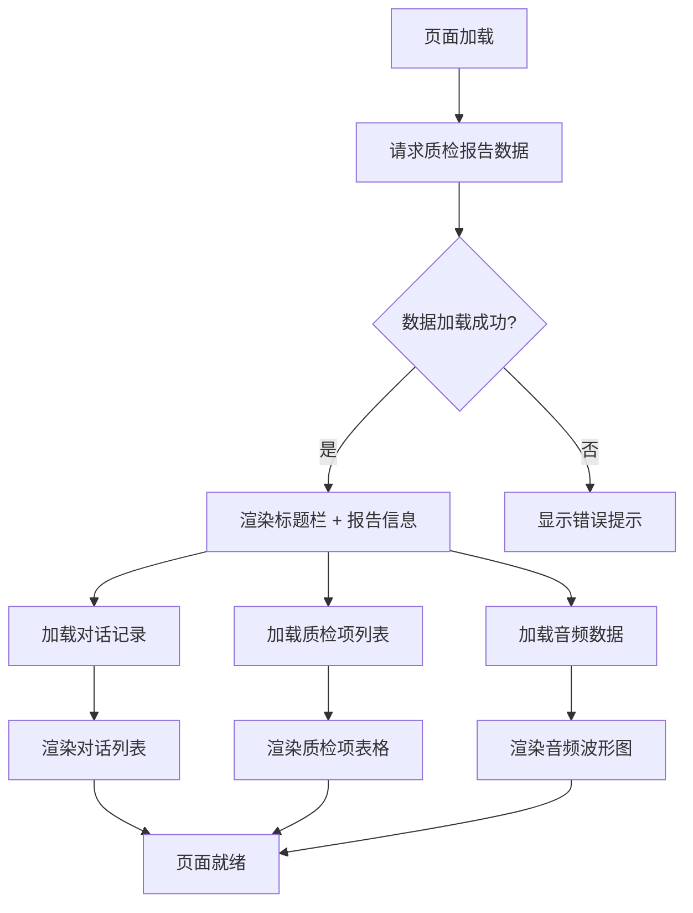
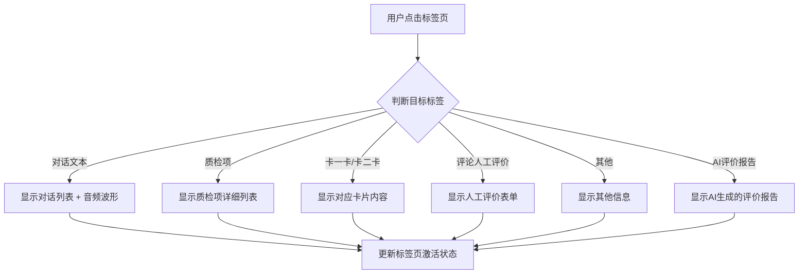
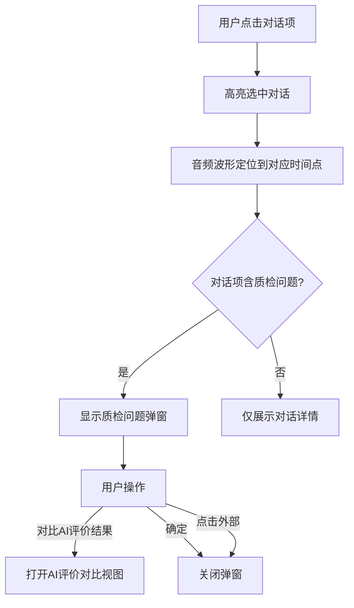
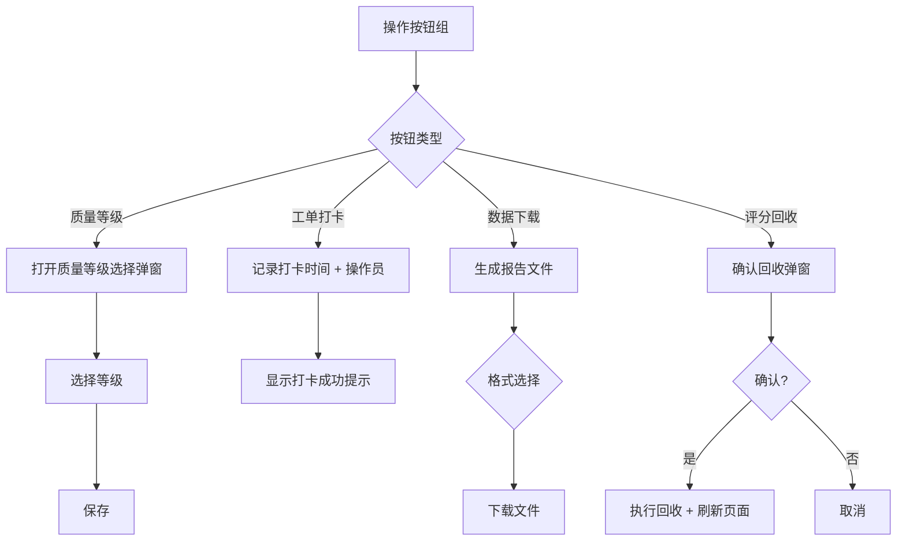
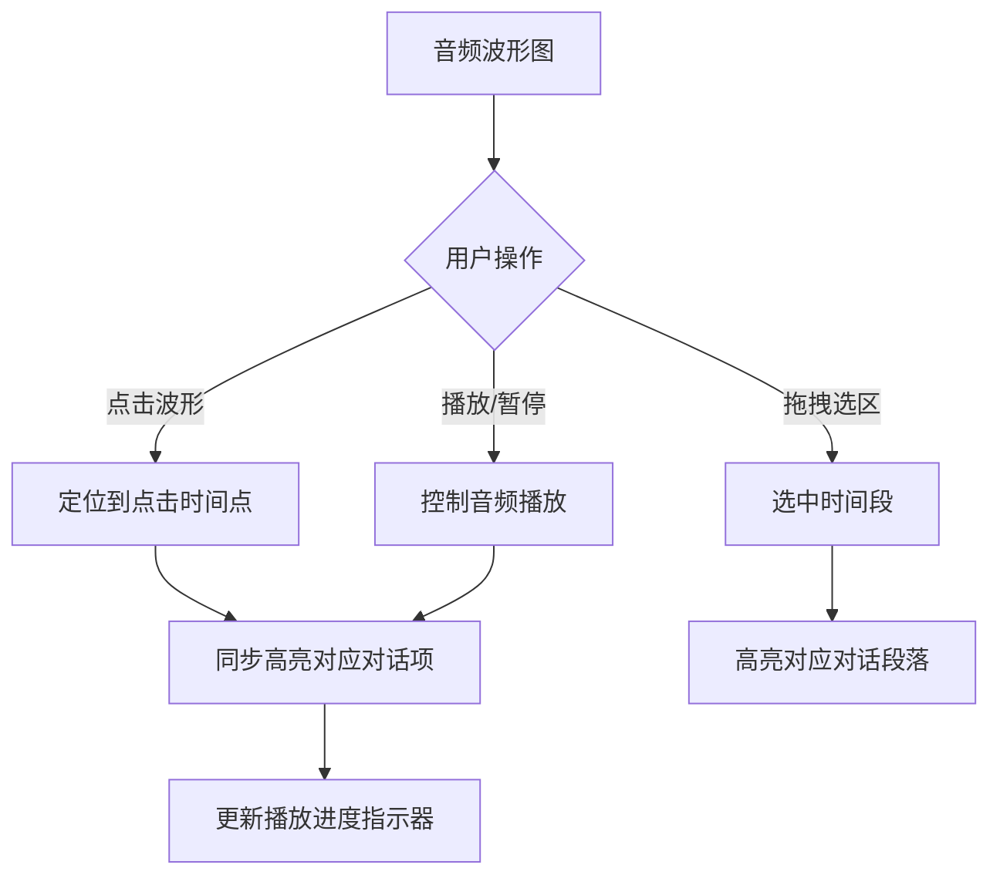

# 智能质检-质检报告(展开状态) - 技术规格文档

## 1. 页面概述

| 属性 | 说明 |
|------|------|
| **页面名称** | 智能质检-质检报告(展开状态) |
| **所属系统** | 中石化智能质检系统 |
| **页面用途** | 展示高级质检报告详情，包含对话文本回放、质检项结果、音频波形可视化等核心功能 |
| **目标用户** | 质检员、质检主管 |
| **页面类型** | 桌面端固定布局（最小宽度 1280px） |
| **核心功能** | 对话记录查看、质检结果展示、音频回放、AI评价对比、评分回收 |
| **数据实体** | 质检报告(reportId)、对话记录(dialogId)、质检项列表、音频数据 |

---

## 2. 页面结构（树状图）

```
Root Container (页面根容器, 浅灰色背景 #F5F5F5)
│
├── [通知横幅] NotificationBanner
│   ├── Text: "欢迎登到墨刀！登录后可同步云端，导出等更多功能"
│   ├── Button: "立即登录"
│   └── CloseIcon (可关闭)
│
└── Main Content Card (白色卡片容器)
    │
    ├── [标题栏] Header Section
    │   ├── Title Area (左侧)
    │   │   └── H1: "高级质检报告_编号: 2026043400B4800/J_批次号: S2026042920504485850B0A4FCE4800177061"
    │   │
    │   └── Action Buttons (右侧, Flex水平排列)
    │       ├── Button: "质量等级" (次要/描边)
    │       ├── Button: "工单打卡" (次要/描边)
    │       ├── Button: "数据下载" (次要/描边)
    │       └── Button: "评分回收" (次要/描边)
    │
    ├── [标签页] Tab Navigation
    │   ├── Tab: "对话文本" (激活态)
    │   ├── Tab: "质检项"
    │   ├── Tab: "卡一卡"
    │   ├── Tab: "卡二卡"
    │   ├── Tab: "评论人工评价"
    │   ├── Tab: "其他"
    │   └── Tab: "AI评价报告"
    │
    ├── [内容区] Content Body (Flex水平排列)
    │   │
    │   ├── [左侧] Dialog Panel (对话列表区)
    │   │   ├── Dialog Item (时间轴式)
    │   │   │   ├── Avatar + Speaker Label
    │   │   │   ├── Bubble (客服: #F7F7F7 / 客户: #E6F7FF)
    │   │   │   ├── Timestamp
    │   │   │   └── Quality Issue Highlight (#FF4D4F)
    │   │   │
    │   │   └── [弹窗] Dialog Detail Modal
    │   │       ├── Content: 质检问题详情
    │   │       ├── Button: "对比AI评价结果"
    │   │       └── Button: "确定"
    │   │
    │   └── [右侧] Detail Panel (详情面板)
    │       ├── Section: "质检结果"
    │       │   ├── Field: 检测类型
    │       │   ├── Field: 检测时间
    │       │   └── Field: 检测结果
    │       │
    │       ├── Section: "质检项" (表格)
    │       │   ├── Column: 质检项目 (auto)
    │       │   ├── Column: 检测结果 (80px)
    │       │   └── Column: 详情 (60px, 操作列)
    │       │
    │       └── Section: "批注"
    │           └── Empty State: "暂无批注" (文档图标)
    │
    └── [底部] Audio Waveform Panel
        ├── Waveform Visualization (蓝色波形)
        ├── Timeline Axis
        └── Playback Controls
```

---

## 3. 布局规范（间距表格）

### 3.1 容器间距

| 容器名称 | Padding | 说明 |
|----------|---------|------|
| 根容器 | — | 页面背景容器，无特定内边距 |
| 主内容区(Card) | `24px` | 白色卡片主容器 |
| 卡片内部区块 | `16px` | 各功能区块内边距 |
| 对话气泡 | `12px 16px` | 上下12px，左右16px |

### 3.2 元素间距

| 元素关系 | Margin/Gap | 方向 |
|----------|-----------|------|
| 标题 → 内容 | `16px` | 垂直 |
| 按钮组间距 | `8px` | 水平 (gap) |
| 对话项间距 | `12px` | 垂直 |
| 表格行间距 | `8px` | 垂直 |
| 表单字段间距 | `12px` | 垂直 (gap) |
| 列表项间距 | `8px` | 垂直 (gap) |

### 3.3 布局模式

| 区域 | 布局方式 | 主轴方向 | 对齐方式 |
|------|---------|---------|----------|
| 页面整体 | Flexbox | Vertical (column) | stretch |
| 标题栏 | Flexbox | Horizontal (row) | space-between / center |
| 操作按钮组 | Flexbox | Horizontal (row) | flex-end, gap: 8px |
| 内容区 | Flexbox | Horizontal (row) | stretch |
| 对话列表 | Flexbox | Vertical (column) | flex-start |
| 详情面板 | Flexbox | Vertical (column) | flex-start |
| 表格行 | Flexbox / Grid | Horizontal (row) | center |

---

## 4. 组件清单

### 4.1 通知横幅 (NotificationBanner)

| 属性 | 值 |
|------|-----|
| 位置 | 页面最顶部 |
| 背景色 | 信息色浅底 |
| 内容 | 文本 + 操作按钮 |
| 可关闭 | `true` |
| Props | `message: string`, `actionText: string`, `onAction: () => void`, `onClose: () => void` |

### 4.2 标题栏 (PageHeader)

| 属性 | 值 |
|------|-----|
| 标题字体 | 16px / 600 / #262626 |
| 布局 | Flex row, space-between |
| 内容格式 | `高级质检报告_编号: {reportId}_批次号: {batchNumber}` |

### 4.3 操作按钮组 (ActionButtonGroup)

| 按钮名称 | 类型 | 样式 | 功能说明 |
|----------|------|------|----------|
| 质量等级 | Secondary | Outlined | 查看/设置质量等级 |
| 工单打卡 | Secondary | Outlined | 记录工单打卡 |
| 数据下载 | Secondary | Outlined | 导出质检数据 |
| 评分回收 | Secondary | Outlined | 回收已有评分 |

**按钮规格：**
- 圆角: `4px`
- 边框: `1px solid #E8E8E8`
- 字号: `14px`
- 状态: default / hover / active / disabled

### 4.4 标签页 (TabNavigation)

| 属性 | 值 |
|------|-----|
| 标签列表 | 对话文本, 质检项, 卡一卡, 卡二卡, 评论人工评价, 其他, AI评价报告 |
| 默认激活 | "对话文本" |
| 激活指示 | 底部蓝色下划线 (#0066FF) |
| 文字样式(默认) | 14px / 400 / #8C8C8C |
| 文字样式(激活) | 14px / 600 / #262626 |

### 4.5 对话列表 (DialogList)

| 属性 | 值 |
|------|-----|
| 布局 | 时间轴式垂直排列 |
| 对话项间距 | `12px` |
| 角色区分 | 客服(左侧, 灰色气泡) / 客户(右侧, 蓝色浅底气泡) |
| 气泡圆角 | `8px` |
| 气泡内边距 | `12px 16px` |
| 高亮标记 | 质检问题文字高亮 `#FF4D4F` |

**对话气泡颜色：**
| 角色 | 背景色 | 文字色 |
|------|--------|--------|
| 客服 | `#F7F7F7` | `#262626` |
| 客户 | `#E6F7FF` | `#262626` |

### 4.6 详情面板 (DetailPanel)

| 区块 | 内容 | 说明 |
|------|------|------|
| 质检结果 | 检测类型、检测时间、检测结果 | 字段-值对展示 |
| 质检项表格 | 多行质检维度 | 含操作列 |
| 批注区 | 空状态 / 批注列表 | 当前为空状态 |

### 4.7 质检项表格 (QualityTable)

| 列名 | 字段Key | 宽度 | 数据类型 | 说明 |
|------|---------|------|----------|------|
| 质检项目 | `itemName` | auto | string | 项目名称 |
| 检测结果 | `result` | 80px | enum | 已通过/未通过/待检测 |
| 详情 | `detail` | 60px | action | 操作按钮（查看详情） |

**表格行状态：**
- Default: 背景 `transparent`
- Hover: 背景 `#F0F0F0`
- Selected: 背景 `#E6F7FF`

### 4.8 音频波形图 (AudioWaveform)

| 属性 | 值 |
|------|-----|
| 位置 | 页面底部 |
| 波形颜色 | `#0066FF` (主色) |
| 背景 | `#FFFFFF` |
| 时间轴 | 底部水平时间标记 |
| 交互 | 点击定位、拖拽选区、播放控制 |

### 4.9 弹窗 (Modal)

| 属性 | 值 |
|------|-----|
| 触发位置 | 对话列表上方 |
| 阴影 | `0 4px 16px rgba(0, 0, 0, 0.12)` |
| 内容 | 对话详情/质检问题 |
| 操作按钮 | "对比AI评价结果"(次要), "确定"(主要) |
| 圆角 | `8px` |

### 4.10 空状态 (EmptyState)

| 属性 | 值 |
|------|-----|
| 位置 | 右下角批注区 |
| 图标 | 文档图标 |
| 文案 | "暂无批注" |
| 文案样式 | 12px / #8C8C8C |

---

## 5. 交互逻辑（Mermaid流程图）

### 5.1 页面主流程



### 5.2 标签页切换流程



### 5.3 对话项交互流程



### 5.4 操作按钮流程



### 5.5 音频波形交互



---

## 6. 设计令牌（CSS变量）

```css
:root {
  /* ==================== 颜色系统 ==================== */
  
  /* 品牌/主色 */
  --color-primary: #0066FF;
  --color-primary-hover: #0052CC;
  --color-primary-active: #003DA6;
  --color-primary-light: #E6F7FF;
  
  /* 功能色 */
  --color-success: #52C41A;
  --color-warning: #FAAD14;
  --color-error: #FF4D4F;
  --color-info: #0066FF;
  
  /* 文本色 */
  --color-text-primary: #262626;
  --color-text-secondary: #8C8C8C;
  --color-text-disabled: #BFBFBF;
  --color-text-highlight: #FF4D4F;
  
  /* 背景色 */
  --color-bg-page: #F5F5F5;
  --color-bg-container: #FFFFFF;
  --color-bg-hover: #F0F0F0;
  --color-bg-bubble-agent: #F7F7F7;
  --color-bg-bubble-customer: #E6F7FF;
  
  /* 边框/分割 */
  --color-border: #E8E8E8;
  --color-divider: #F0F0F0;
  
  /* ==================== 字体系统 ==================== */
  
  /* 字号 */
  --font-size-lg: 16px;
  --font-size-md: 14px;
  --font-size-sm: 12px;
  
  /* 行高 */
  --line-height-lg: 24px;
  --line-height-md: 22px;
  --line-height-sm: 20px;
  
  /* 字重 */
  --font-weight-regular: 400;
  --font-weight-semibold: 600;
  
  /* 组合 - 标题大 */
  --font-title-lg-size: var(--font-size-lg);
  --font-title-lg-height: var(--line-height-lg);
  --font-title-lg-weight: var(--font-weight-semibold);
  
  /* 组合 - 标题中 */
  --font-title-md-size: var(--font-size-md);
  --font-title-md-height: var(--line-height-md);
  --font-title-md-weight: var(--font-weight-semibold);
  
  /* 组合 - 正文 */
  --font-body-size: var(--font-size-md);
  --font-body-height: var(--line-height-md);
  --font-body-weight: var(--font-weight-regular);
  
  /* 组合 - 正文小 */
  --font-body-sm-size: var(--font-size-sm);
  --font-body-sm-height: var(--line-height-sm);
  --font-body-sm-weight: var(--font-weight-regular);
  
  /* 组合 - 辅助文本 */
  --font-caption-size: var(--font-size-sm);
  --font-caption-height: var(--line-height-sm);
  --font-caption-weight: var(--font-weight-regular);
  --font-caption-color: var(--color-text-secondary);
  
  /* ==================== 间距系统 ==================== */
  
  --spacing-xs: 4px;
  --spacing-sm: 8px;
  --spacing-md: 12px;
  --spacing-lg: 16px;
  --spacing-xl: 24px;
  --spacing-xxl: 32px;
  
  /* 容器间距 */
  --padding-container: var(--spacing-xl);       /* 24px */
  --padding-card: var(--spacing-lg);            /* 16px */
  --padding-bubble-v: var(--spacing-md);        /* 12px */
  --padding-bubble-h: var(--spacing-lg);        /* 16px */
  
  /* 元素间距 */
  --gap-button-group: var(--spacing-sm);        /* 8px */
  --gap-form-field: var(--spacing-md);          /* 12px */
  --gap-list-item: var(--spacing-sm);           /* 8px */
  --gap-dialog-item: var(--spacing-md);         /* 12px */
  --margin-title-content: var(--spacing-lg);    /* 16px */
  --margin-table-row: var(--spacing-sm);        /* 8px */
  
  /* ==================== 圆角系统 ==================== */
  
  --radius-sm: 2px;
  --radius-md: 4px;
  --radius-lg: 8px;
  
  --radius-button: var(--radius-md);            /* 4px */
  --radius-card: var(--radius-lg);              /* 8px */
  --radius-input: var(--radius-md);             /* 4px */
  --radius-tag: var(--radius-sm);               /* 2px */
  --radius-bubble: var(--radius-lg);            /* 8px */
  
  /* ==================== 阴影系统 ==================== */
  
  --shadow-card: 0 2px 8px rgba(0, 0, 0, 0.08);
  --shadow-modal: 0 4px 16px rgba(0, 0, 0, 0.12);
  --shadow-hover: 0 4px 12px rgba(0, 0, 0, 0.1);
  
  /* ==================== 动画系统 ==================== */
  
  --transition-fast: 150ms ease;
  --transition-normal: 250ms ease;
  --transition-slow: 350ms ease;
  
  /* ==================== 层级系统 ==================== */
  
  --z-index-base: 1;
  --z-index-dropdown: 100;
  --z-index-sticky: 200;
  --z-index-modal-backdrop: 900;
  --z-index-modal: 1000;
  --z-index-notification: 1100;
}
```

---

## 7. 响应式策略

### 7.1 设计约束

| 属性 | 值 |
|------|-----|
| 目标设备 | 桌面端 |
| 最小支持宽度 | 1280px |
| 推荐分辨率 | 1920×1080 |
| 布局模式 | 固定布局（非响应式优先） |

### 7.2 宽度适配策略

| 视口范围 | 策略 | 说明 |
|----------|------|------|
| ≥ 1920px | 内容区最大宽度限制或居中 | 防止过度拉伸 |
| 1280px - 1920px | 主布局自适应 | 左右面板按比例分配 |
| < 1280px | 出现水平滚动条 | 不做移动端适配 |

### 7.3 面板比例建议

```
┌─────────────────────────────────────────────────┐
│                  Header (100%)                   │
├─────────────────────────────────────────────────┤
│                  Tabs (100%)                     │
├───────────────────────────┬─────────────────────┤
│    Dialog Panel (60%)     │  Detail Panel (40%) │
│                           │                     │
│                           │                     │
├───────────────────────────┴─────────────────────┤
│            Audio Waveform (100%)                 │
└─────────────────────────────────────────────────┘
```

### 7.4 溢出处理

| 区域 | 溢出策略 |
|------|----------|
| 对话列表 | `overflow-y: auto`，垂直滚动 |
| 详情面板 | `overflow-y: auto`，垂直滚动 |
| 标题文本 | `text-overflow: ellipsis`，单行截断 |
| 表格 | 固定表头，内容区滚动 |
| 音频波形 | 水平滚动 + 缩放控制 |

---

## 8. 实现建议

### 8.1 技术栈推荐

| 类别 | 推荐方案 | 备选方案 |
|------|---------|---------|
| 框架 | React 18+ | Vue 3 |
| UI组件库 | Ant Design 5.x | Arco Design |
| 状态管理 | Zustand / Redux Toolkit | Pinia (Vue) |
| 样式方案 | CSS Modules + CSS Variables | Styled Components / Tailwind |
| 音频波形 | WaveSurfer.js | Peaks.js |
| 图表 | — | ECharts (如需扩展) |
| HTTP客户端 | Axios | SWR / React Query |
| 构建工具 | Vite | Webpack 5 |

### 8.2 组件拆分建议

```
src/
├── pages/
│   └── QualityReport/
│       ├── index.tsx                    # 页面入口
│       ├── QualityReport.module.css     # 页面样式
│       └── components/
│           ├── ReportHeader/            # 标题栏 + 操作按钮
│           ├── TabNavigation/           # 标签页导航
│           ├── DialogPanel/             # 对话列表面板
│           │   ├── DialogItem/          # 单条对话
│           │   ├── DialogBubble/        # 对话气泡
│           │   └── IssueHighlight/      # 问题高亮标记
│           ├── DetailPanel/             # 右侧详情面板
│           │   ├── InspectionResult/    # 质检结果区
│           │   ├── QualityTable/        # 质检项表格
│           │   └── AnnotationSection/   # 批注区(含空状态)
│           ├── AudioWaveform/           # 音频波形组件
│           ├── DetailModal/             # 对话详情弹窗
│           └── NotificationBanner/      # 顶部通知横幅
├── hooks/
│   ├── useQualityReport.ts             # 报告数据获取
│   ├── useDialogList.ts                # 对话列表逻辑
│   ├── useAudioPlayer.ts              # 音频播放控制
│   └── useWaveformSync.ts            # 波形与对话同步
├── services/
│   └── qualityApi.ts                   # API接口定义
├── types/
│   └── quality.ts                      # TypeScript类型定义
└── styles/
    └── tokens.css                      # 设计令牌CSS变量
```

### 8.3 关键数据接口

```typescript
// types/quality.ts

interface QualityReport {
  reportId: string;                    // 报告编号
  batchNumber: string;                 // 批次号
  inspectionType: string;             // 检测类型
  inspectionTime: string;             // 检测时间
  inspectionResult: string;           // 检测结果
  dialogs: DialogRecord[];            // 对话记录
  qualityItems: QualityItem[];        // 质检项
  audioData: AudioData;               // 音频数据
}

interface DialogRecord {
  dialogId: string;
  speaker: 'agent' | 'customer';      // 客服 | 客户
  speakerId: string;
  content: string;
  timestamp: string;
  duration: number;                    // 秒
  qualityIssues?: QualityIssue[];
}

interface QualityIssue {
  issueType: string;
  description: string;
  severity: 'high' | 'medium' | 'low';
}

interface QualityItem {
  itemName: string;
  result: '已通过' | '未通过' | '待检测';
  score?: number;
}

interface AudioData {
  audioUrl: string;
  duration: number;
  waveformData: number[];
  markers: AudioMarker[];
}

interface AudioMarker {
  time: number;
  type: string;
  label: string;
}
```

### 8.4 性能优化建议

| 优化点 | 策略 | 优先级 |
|--------|------|--------|
| 对话列表虚拟滚动 | 使用 `react-virtual` 或 `react-window` | 高 |
| 音频波形懒加载 | 进入视口后加载波形数据 | 高 |
| 标签页内容按需渲染 | 非激活标签页不渲染 DOM | 中 |
| API数据缓存 | React Query / SWR 缓存策略 | 中 |
| 大文件音频分片加载 | 流式加载 + 渐进式渲染波形 | 中 |
| 弹窗组件懒加载 | `React.lazy()` + `Suspense` | 低 |

### 8.5 可访问性 (A11y)

| 组件 | ARIA属性 | 键盘交互 |
|------|---------|---------|
| 标签页 | `role="tablist"`, `role="tab"`, `aria-selected` | ← → 切换, Enter 激活 |
| 对话列表 | `role="list"`, `role="listitem"` | ↑ ↓ 导航 |
| 弹窗 | `role="dialog"`, `aria-modal="true"` | Esc 关闭, Tab 焦点困 |
| 按钮 | `aria-label` (如图标按钮) | Enter / Space 触发 |
| 表格 | `role="table"`, `scope="col"` | Tab 导航单元格 |
| 音频播放 | `role="slider"`, `aria-valuenow` | Space 播放/暂停 |
| 通知横幅 | `role="alert"`, `aria-live="polite"` | — |

### 8.6 开发注意事项

1. **对话-音频同步**：对话列表点击应精确定位音频时间点，音频播放进度应实时高亮对应对话项，建议使用发布-订阅模式解耦。

2. **质检问题标注**：对话文本中的问题标注需支持多段高亮，建议使用 `<mark>` 标签或自定义 `Highlight` 组件。

3. **弹窗层叠管理**：页面可能同时存在通知横幅和详情弹窗，需合理管理 z-index 层级。

4. **表格状态同步**：质检项表格选中行应与左侧对话列表高亮联动。

5. **音频波形性能**：WaveSurfer.js 在大音频文件下可能存在性能问题，建议预计算波形数据由后端提供 `waveformData` 数组。

6. **设计令牌统一**：所有颜色、间距、字体等样式值必须引用 CSS 变量，禁止硬编码，确保主题一致性与后续可维护性。

---

*文档版本: v1.0*  
*生成日期: 2025年*  
*适用范围: 中石化智能质检系统 - 质检报告详情页*