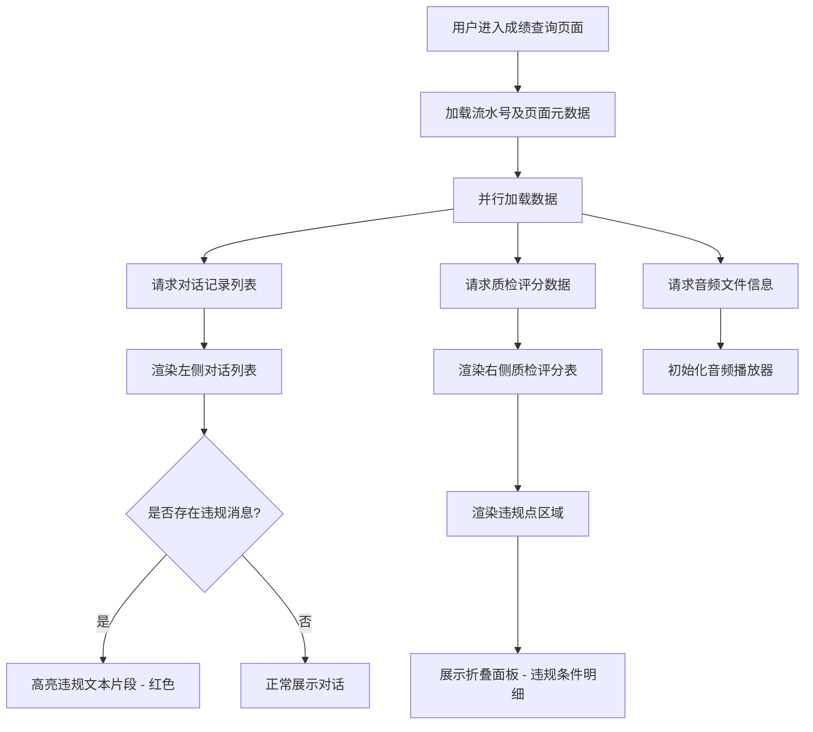
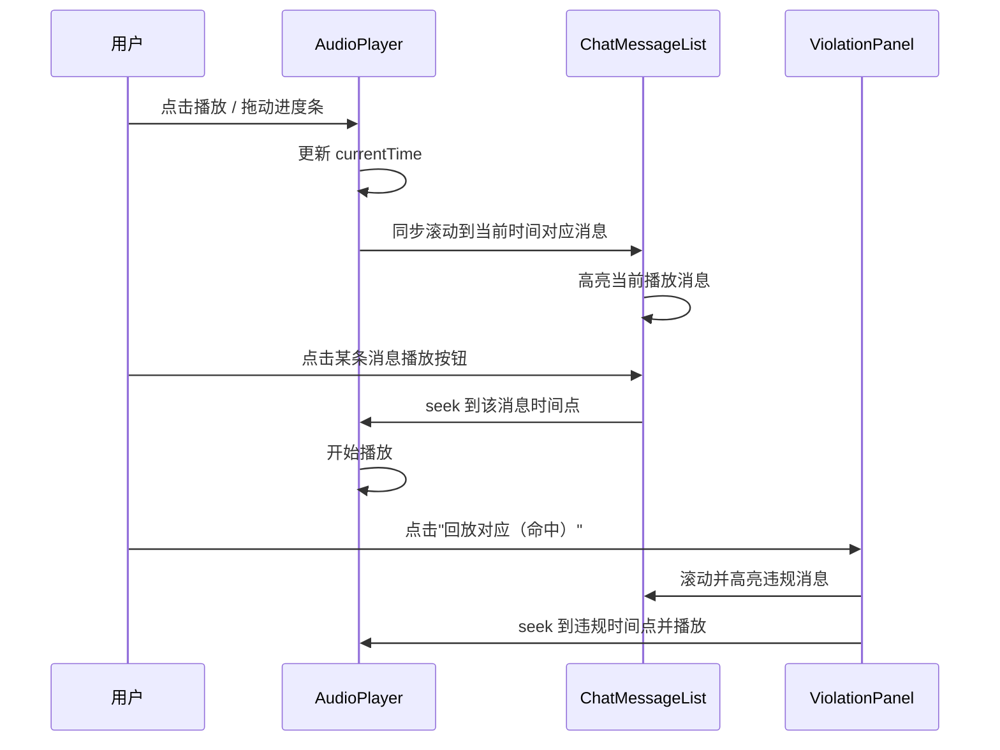

# 智能质检-坐席申诉-成绩查询 - 技术规格文档

## 1. 页面概述

| 属性 | 说明 |
|------|------|
| **页面名称** | 智能质检-坐席申诉-成绩查询 |
| **页面用途** | 展示客服通话质检结果，支持对话回放、质检评分查看、违规点定位及坐席申诉操作 |
| **页面布局** | 顶部信息栏 + 左右双栏主体布局（左侧对话记录/音频播放，右侧质检结果面板） |
| **设计基准** | 1440 × 900px（基于 4px 栅格系统） |
| **字体方案** | PingFang SC, Microsoft YaHei, sans-serif |
| **UI 框架建议** | Ant Design / Element Plus |

**核心用户流程：** 用户通过流水号进入质检成绩详情页 → 左侧查看完整对话记录及音频回放 → 右侧查看质检评分与违规明细 → 针对异议项发起申诉。

---

## 2. 页面结构（树状图）

```
PageContainer (Flex/column)
│
├── Header (Flex/row, justify: space-between, align: center)
│   ├── FlowNumber [Text/Label] ─ "流水号: S2026042923..."
│   └── HeaderActions [ButtonGroup]
│       ├── Button "文本下载" (outlined)
│       ├── Button "立即下载" (outlined)
│       ├── Button "录音试听" (outlined)
│       └── Button "回传记录查询" (outlined)
│
└── MainContent (Flex/row, gap: 16px)
    │
    ├── LeftPanel (Flex/column, ~60%)
    │   ├── ChatToolbar (Flex/row, align: center, h: 32px)
    │   │   ├── Button "筛选文本" (text)
    │   │   ├── Toggle "开场白" (active/green)
    │   │   ├── Text "开场 0"
    │   │   ├── Text "篇 0"
    │   │   ├── Button "上一个" (icon: arrow-left)
    │   │   ├── Button "下一个" (icon: arrow-right)
    │   │   └── Input "请输入关键词、序号、会话标识"
    │   │
    │   ├── ChatMessageList (Flex/column, scrollable)
    │   │   ├── AgentMessage (align: left)
    │   │   │   ├── Avatar (32×32, left)
    │   │   │   ├── Bubble (#F5F5F5, border-radius: 8px)
    │   │   │   │   └── Text (含红色高亮违规片段)
    │   │   │   ├── Badge [字数/时间]
    │   │   │   └── IconButton [播放音频]
    │   │   │
    │   │   └── CustomerMessage (align: right)
    │   │       ├── Bubble (#FFFFFF, border-radius: 8px)
    │   │       ├── Avatar (32×32, right)
    │   │       ├── Badge [字数/时间]
    │   │       └── IconButton [播放音频]
    │   │
    │   ├── ToggleViewButton "分页" (small)
    │   │
    │   └── AudioWaveform (Flex/column, h: 48px)
    │       ├── Waveform [波形可视化, 蓝绿色]
    │       ├── Timeline [时间刻度轴]
    │       └── PlaybackControl "00:10/03:06"
    │
    └── RightPanel (Flex/column, ~40%, padding: 12px)
        ├── QualityScoreHeader (Flex/row, justify: space-between)
        │   ├── Title "成绩结果（质检成绩）"
        │   ├── Text "质检时:"
        │   └── Button "申诉" (danger/red)
        │
        ├── QualityScoreTable [Table]
        │   ├── THead: 质检任务 | 质检员 | 复检员中 | 质检备中 | 评价
        │   └── TBody: 6~7 rows (含扣分、未命中等状态)
        │
        ├── ViolationSection (Flex/column, border: #FF4D4F)
        │   ├── ViolationTag "违规点" (#FF4D4F bg, #FFF text)
        │   ├── AlertBox [红色警告, 违规详情描述]
        │   └── ViolationDetails [Accordion/Collapse]
        │       ├── Item "条件A 类/行为规范" → "回放对应（命中）" [#1890FF]
        │       └── Item "条件B 通用/文明用语" → "未命中"
        │
        └── Pagination
            ├── Text "总量: 50"
            └── Text "页码: 1/1"
```

---

## 3. 布局规范（间距表格）

### 3.1 基础栅格

| 属性 | 值 | 说明 |
|------|-----|------|
| Base Unit | `4px` | 所有间距为 4 的整数倍 |
| 栅格列数 | 24 | 左侧约 14 列，右侧约 10 列 |

### 3.2 容器间距

| 容器 | 属性 | 值 (px) | CSS 变量建议 |
|------|------|---------|-------------|
| **PageContainer** | padding-top | `16` | `--page-pt` |
| | padding-right | `24` | `--page-pr` |
| | padding-bottom | `16` | `--page-pb` |
| | padding-left | `24` | `--page-pl` |
| **Header** | padding-vertical | `12` | `--header-pv` |
| | padding-horizontal | `0` | `--header-ph` |
| | margin-bottom | `16` | `--header-mb` |
| **MainContent** | gap | `16` | `--main-gap` |
| **LeftPanel** | padding | `0` | — |
| **RightPanel** | padding (all) | `12` | `--right-panel-p` |

### 3.3 组件级间距

| 组件区域 | 属性 | 值 (px) | 说明 |
|----------|------|---------|------|
| **ChatToolbar** | height | `32` | 固定高度 |
| | gap (子元素间) | `8` | 工具项间距 |
| | margin-bottom | `12` | 与消息列表间距 |
| **ChatMessages** | message-gap | `16` | 消息间垂直间距 |
| | bubble-padding | `12` | 气泡内边距 |
| | avatar-size | `32 × 32` | 头像尺寸 |
| | avatar-to-message | `8` | 头像与气泡间距 |
| **QualityTable** | cell-padding-v | `8` | 单元格垂直内边距 |
| | cell-padding-h | `12` | 单元格水平内边距 |
| | row-gap | `0` | 行间无额外间距（用 border 分隔） |
| **ViolationSection** | padding | `12` | 区块内边距 |
| | margin-top | `12` | 与上方表格间距 |
| | item-gap | `8` | 违规条目间间距 |
| **AudioWaveform** | height | `48` | 固定高度 |
| | margin-top | `12` | 与上方内容间距 |
| **ActionButtons** | gap | `8` | 按钮间间距 |
| | button-padding-v | `4` | 按钮垂直内边距 |
| | button-padding-h | `12` | 按钮水平内边距 |

---

## 4. 组件清单

### 4.1 组件总览

| # | 组件 ID | 类型 | 位置 | 状态/变体 | 数据绑定 |
|---|---------|------|------|-----------|----------|
| 1 | `flowNumber` | Text/Label | Header 左侧 | readonly | `pageMetadata.flowNumber` |
| 2 | `headerActions` | ButtonGroup | Header 右侧 | 4 个 outlined 按钮 | — |
| 3 | `chatToolbar` | Toolbar | 左侧面板顶部 | 含 Toggle/Input/Button | `searchForm.keyword` |
| 4 | `chatMessages` | ChatMessageList | 左侧面板主体 | 可滚动, 含违规高亮 | `chatMessage[]` |
| 5 | `messageTimestamp` | Badge/Tag | 每条消息右下角 | 字数/时间 | `chatMessage.wordCount` / `.timestamp` |
| 6 | `playMessageAudio` | IconButton | 每条消息右侧 | 播放/暂停 | `chatMessage.id` |
| 7 | `toggleView` | Button | 左右面板分隔处 | small variant | — |
| 8 | `audioWaveform` | AudioPlayer | 左侧面板底部 | 波形+时间轴+进度 | `audioPlayback` |
| 9 | `qualityResultPanel` | Panel | 右侧面板 | 带标题栏 | — |
| 10 | `qualityScoreTable` | Table | 右侧面板上部 | 5 列 × ~7 行 | `qualityInspectionScore[]` |
| 11 | `violationAlert` | AlertBox | 右侧面板中部 | danger border (#FF4D4F) | `violationDetail` |
| 12 | `violationTag` | Tag | 违规区域标题 | 红底白字 | — |
| 13 | `violationDetails` | Accordion/Collapse | 右侧面板下部 | 可展开/收起 | `violationDetail[]` |
| 14 | `pagination` | Pagination | 右侧面板底部 | 总量 + 页码 | `audioPlayback.pageSize` / `.currentPage` |

### 4.2 关键组件详细规格

#### 4.2.1 ChatMessageList (`chatMessages`)

```
┌──────────────────────────────────────────────────────┐
│  [Avatar 32px]  ┌─────────────────────────────┐      │
│      8px gap →  │  Agent Bubble (#F5F5F5)     │  ▶️  │
│                 │  padding: 12px              │      │
│                 │  border-radius: 8px         │      │
│                 │  "对话文本内容..."            │      │
│                 │  <span class="violation">    │      │
│                 │    红色高亮违规文本           │      │
│                 │  </span>                    │      │
│                 └─────────────────────────────┘      │
│                                        [15字 00:12]  │
│                          ↑ 16px gap ↓                │
│      ┌─────────────────────────────┐  [Avatar 32px]  │
│  ▶️  │  Customer Bubble (#FFFFFF)  │  ← 8px gap     │
│      │  padding: 12px              │                 │
│      │  border-radius: 8px         │                 │
│      │  "客户回复内容..."            │                 │
│      └─────────────────────────────┘                 │
│                                        [20字 00:15]  │
└──────────────────────────────────────────────────────┘
```

**数据结构：**

```typescript
interface ChatMessage {
  id: string;                    // 消息唯一ID
  role: 'agent' | 'customer';   // 发送者角色
  content: string;               // 消息文本内容
  timestamp: string;             // 消息时间 HH:mm
  wordCount: number;             // 消息字数
  duration: string;              // 语音时长
  isViolation: boolean;          // 是否为违规消息
  violationHighlight: string[];  // 违规高亮文本片段
}
```

#### 4.2.2 QualityScoreTable (`qualityScoreTable`)

| 列名 | 字段 Key | 数据类型 | 宽度 | 对齐方式 | 说明 |
|------|----------|---------|------|----------|------|
| 质检任务 | `taskName` | string | auto (flex:1) | left | 任务名称 |
| 质检员 | `inspector` | string | 80px | center | 质检员标识 |
| 复检员中 | `reviewer` | string | 80px | center | 复检员状态 |
| 质检备中 | `inspectionStatus` | string | 80px | center | 质检备注状态 |
| 评价 | `score` | number | 60px | center | 扣分为红色负数，0 为灰色 |

**示例数据：**

```json
[
  { "taskName": "服务态度",       "inspector": "/",    "reviewer": "/",    "inspectionStatus": "/",    "score": null },
  { "taskName": "业务行为规范",   "inspector": "全检件", "reviewer": "只检件", "inspectionStatus": "/",    "score": -5 },
  { "taskName": "未及时回复",     "inspector": "全检件", "reviewer": "全检件", "inspectionStatus": "未命中", "score": 0 },
  { "taskName": "用头用户...",    "inspector": "全检件", "reviewer": "全检件", "inspectionStatus": "未命中", "score": 0 },
  { "taskName": "服务禁忌...",    "inspector": "全检件", "reviewer": "全检件", "inspectionStatus": "未命中", "score": 0 },
  { "taskName": "未来回忆...",    "inspector": "全检件", "reviewer": "全检件", "inspectionStatus": "未命中", "score": 0 }
]
```

#### 4.2.3 ViolationDetails (`violationDetails`)

```typescript
interface ViolationDetail {
  category: string;                     // 违规类别（条件A/条件B）
  ruleName: string;                     // 规则名称
  hitStatus: '命中' | '未命中';         // 命中状态
  playbackLink?: string;               // 回放对应链接（命中时可用）
}
```

---

## 5. 交互逻辑（Mermaid流程图）

### 5.1 页面主流程



### 5.2 用户操作交互

```mermaid
flowchart TD
    subgraph 左侧面板操作
        L1[点击筛选文本] --> L2[过滤对话列表]
        L3[切换开场白 Toggle] --> L4[显示/隐藏开场白消息]
        L5[输入关键词搜索] --> L6[高亮匹配消息并定位]
        L7[点击上一个/下一个] --> L8[跳转到匹配项]
        L9[点击消息播放按钮 ▶️] --> L10[播放单条消息音频]
        L11[操作音频播放器] --> L12[同步高亮当前对话消息]
    end

    subgraph 右侧面板操作
        R1[查看质检评分表] --> R2{存在扣分项?}
        R2 -->|是| R3[扣分项红色显示]
        R2 -->|否| R4[正常灰色显示]
        R5[点击申诉按钮] --> R6[打开申诉弹窗/跳转申诉页]
        R7[展开违规条件折叠面板] --> R8{命中状态?}
        R8 -->|命中| R9[显示"回放对应"链接 - 蓝色]
        R9 --> R10[点击回放 → 定位到对应对话+播放音频]
        R8 -->|未命中| R11[显示"未命中"灰色文本]
    end

    subgraph Header操作
        H1[点击文本下载] --> H2[下载对话文本文件]
        H3[点击立即下载] --> H4[下载质检报告]
        H5[点击录音试听] --> H6[全屏播放录音]
        H7[点击回传记录查询] --> H8[跳转回传记录页]
    end
```

### 5.3 音频与对话联动



---

## 6. 设计令牌（CSS变量）

```css
:root {
  /* ========== 颜色系统 ========== */
  
  /* 主色 */
  --color-primary:                #1890FF;
  --color-danger:                 #FF4D4F;
  --color-success:                #52C41A;
  
  /* 文本色 */
  --color-text-primary:           #333333;
  --color-text-secondary:         #666666;
  --color-text-tertiary:          #999999;
  
  /* 背景色 */
  --color-bg-page:                #F0F2F5;
  --color-bg-card:                #FFFFFF;
  --color-bg-bubble-agent:        #F5F5F5;
  --color-bg-bubble-customer:     #FFFFFF;
  
  /* 边框色 */
  --color-border-default:         #D9D9D9;
  --color-border-danger:          #FF4D4F;
  
  /* 功能色 */
  --color-highlight-text:         #FF4D4F;
  --color-tag-violation-bg:       #FF4D4F;
  --color-tag-violation-text:     #FFFFFF;
  --color-link:                   #1890FF;
  --color-waveform:               #13C2C2;
  --color-audio-timeline-bg:      #1A1A2E;
  
  /* ========== 字体系统 ========== */
  
  --font-family:                  'PingFang SC', 'Microsoft YaHei', sans-serif;
  
  /* H1 */
  --font-size-h1:                 20px;
  --line-height-h1:               28px;
  --font-weight-h1:               600;
  
  /* H2 */
  --font-size-h2:                 16px;
  --line-height-h2:               24px;
  --font-weight-h2:               600;
  
  /* Body */
  --font-size-body:               14px;
  --line-height-body:             22px;
  --font-weight-body:             400;
  
  /* Caption */
  --font-size-caption:            12px;
  --line-height-caption:          20px;
  --font-weight-caption:          400;
  
  /* Table Header */
  --font-size-table-header:       14px;
  --line-height-table-header:     22px;
  --font-weight-table-header:     500;
  
  /* Table Cell */
  --font-size-table-cell:         14px;
  --line-height-table-cell:       22px;
  --font-weight-table-cell:       400;
  
  /* Button */
  --font-size-button:             14px;
  --line-height-button:           22px;
  --font-weight-button:           400;
  
  /* Tag */
  --font-size-tag:                12px;
  --line-height-tag:              20px;
  --font-weight-tag:              500;
  
  /* ========== 间距系统 (基于 4px 基准) ========== */
  
  --spacing-base:                 4px;
  --spacing-2:                    8px;    /* 4 × 2 */
  --spacing-3:                    12px;   /* 4 × 3 */
  --spacing-4:                    16px;   /* 4 × 4 */
  --spacing-6:                    24px;   /* 4 × 6 */
  --spacing-8:                    32px;   /* 4 × 8 */
  --spacing-12:                   48px;   /* 4 × 12 */
  
  /* 页面容器 */
  --page-padding-top:             var(--spacing-4);    /* 16px */
  --page-padding-right:           var(--spacing-6);    /* 24px */
  --page-padding-bottom:          var(--spacing-4);    /* 16px */
  --page-padding-left:            var(--spacing-6);    /* 24px */
  
  /* Header */
  --header-padding-vertical:      var(--spacing-3);    /* 12px */
  --header-margin-bottom:         var(--spacing-4);    /* 16px */
  
  /* 主内容 */
  --main-content-gap:             var(--spacing-4);    /* 16px */
  
  /* 对话区 */
  --chat-toolbar-height:          var(--spacing-8);    /* 32px */
  --chat-toolbar-gap:             var(--spacing-2);    /* 8px */
  --chat-toolbar-mb:              var(--spacing-3);    /* 12px */
  --chat-message-gap:             var(--spacing-4);    /* 16px */
  --chat-bubble-padding:          var(--spacing-3);    /* 12px */
  --chat-avatar-size:             var(--spacing-8);    /* 32px */
  --chat-avatar-gap:              var(--spacing-2);    /* 8px */
  
  /* 右侧面板 */
  --right-panel-padding:          var(--spacing-3);    /* 12px */
  --table-cell-padding-v:         var(--spacing-2);    /* 8px */
  --table-cell-padding-h:         var(--spacing-3);    /* 12px */
  
  /* 违规区 */
  --violation-padding:            var(--spacing-3);    /* 12px */
  --violation-margin-top:         var(--spacing-3);    /* 12px */
  --violation-item-gap:           var(--spacing-2);    /* 8px */
  
  /* 音频区 */
  --audio-waveform-height:        var(--spacing-12);   /* 48px */
  --audio-waveform-mt:            var(--spacing-3);    /* 12px */
  
  /* 按钮组 */
  --button-group-gap:             var(--spacing-2);    /* 8px */
  --button-padding-v:             var(--spacing-base); /* 4px */
  --button-padding-h:             var(--spacing-3);    /* 12px */
  
  /* ========== 圆角系统 ========== */
  
  --radius-none:                  0px;
  --radius-sm:                    2px;
  --radius-md:                    4px;
  --radius-lg:                    8px;
  --radius-button:                4px;
  --radius-tag:                   4px;
  --radius-card:                  4px;
  --radius-chat-bubble:           8px;
  
  /* ========== 阴影系统 ========== */
  
  --shadow-card:                  0 1px 4px rgba(0, 0, 0, 0.08);
  --shadow-panel:                 0 2px 8px rgba(0, 0, 0, 0.1);
  --shadow-none:                  none;
}
```

---

## 7. 响应式策略

### 7.1 断点定义

| 断点名称 | 范围 | 布局策略 |
|----------|------|----------|
| **Desktop-L** | ≥ 1440px | 默认布局，左60%/右40%，所有功能完整展示 |
| **Desktop-M** | 1200px – 1439px | 保持双栏，比例调整为 55%/45%，表格列可适当压缩 |
| **Desktop-S** | 992px – 1199px | 保持双栏，比例调整为 50%/50%，Header 按钮组折叠为下拉菜单 |
| **Tablet** | 768px – 991px | 切换为单栏，上下堆叠（对话区在上，质检结果在下），或使用 Tab 切换 |
| **Mobile** | < 768px | 单栏纵向堆叠，音频播放器固定底部，表格改为卡片列表 |

### 7.2 各断点关键调整

```css
/* Desktop-M */
@media (max-width: 1439px) {
  .left-panel  { flex: 0 0 55%; }
  .right-panel { flex: 0 0 calc(45% - 16px); }
}

/* Desktop-S */
@media (max-width: 1199px) {
  .left-panel  { flex: 0 0 50%; }
  .right-panel { flex: 0 0 calc(50% - 16px); }
  .header-actions { /* 按钮折叠为更多菜单 */ }
}

/* Tablet */
@media (max-width: 991px) {
  .main-content {
    flex-direction: column;
  }
  .left-panel,
  .right-panel {
    flex: 1 1 100%;
    width: 100%;
  }
  .audio-waveform {
    position: sticky;
    bottom: 0;
    z-index: 10;
  }
}

/* Mobile */
@media (max-width: 767px) {
  .page-container {
    padding: 12px 16px;
  }
  .quality-score-table {
    /* 转为卡片式展示 */
    display: block;
  }
  .chat-toolbar {
    flex-wrap: wrap;
  }
}
```

### 7.3 组件响应式行为

| 组件 | ≥ 1200px | 992–1199px | 768–991px | < 768px |
|------|----------|------------|-----------|---------|
| Header ButtonGroup | 横排平铺 | 横排平铺 | 折叠为 Dropdown | 折叠为 Dropdown |
| MainContent 布局 | 左右双栏 | 左右双栏 | 上下堆叠 | 上下堆叠 |
| ChatToolbar | 单行横排 | 单行横排 | 允许换行 | 两行展示 |
| QualityScoreTable | 标准表格 | 标准表格 | 标准表格 | 卡片列表 |
| AudioPlayer | 内嵌底部 | 内嵌底部 | Sticky 底部 | Sticky 底部 |
| ViolationDetails | 折叠面板 | 折叠面板 | 折叠面板 | 折叠面板 |
| Pagination | 标准展示 | 标准展示 | 简洁模式 | 简洁模式 |

---

## 8. 实现建议

### 8.1 推荐技术栈

| 层面 | 推荐方案 | 备选方案 |
|------|----------|----------|
| **框架** | Vue 3 + Composition API | React 18 + Hooks |
| **UI 库** | Ant Design Vue 4.x | Element Plus 2.x |
| **状态管理** | Pinia | Vuex 4 / Zustand (React) |
| **音频可视化** | WaveSurfer.js | Howler.js + Canvas 自绘 |
| **样式方案** | CSS Modules + CSS Variables | Tailwind CSS / UnoCSS |
| **构建工具** | Vite 5 | Webpack 5 |

### 8.2 组件拆分建议

```
src/
├── views/
│   └── QualityInspectionDetail/
│       ├── index.vue                        # 页面入口
│       ├── composables/
│       │   ├── useQualityData.ts            # 质检数据加载
│       │   ├── useChatMessages.ts           # 对话消息管理
│       │   ├── useAudioPlayer.ts            # 音频播放控制
│       │   └── useViolationHighlight.ts     # 违规高亮联动
│       └── components/
│           ├── PageHeader.vue               # 顶部信息栏
│           ├── ChatPanel/
│           │   ├── ChatToolbar.vue          # 对话筛选工具栏
│           │   ├── ChatMessageList.vue      # 对话消息列表
│           │   ├── ChatBubble.vue           # 单条消息气泡
│           │   └── AudioWaveform.vue        # 音频波形播放器
│           └── QualityPanel/
│               ├── QualityScoreHeader.vue   # 质检结果标题
│               ├── QualityScoreTable.vue    # 质检评分表
│               ├── ViolationSection.vue     # 违规区域
│               ├── ViolationAlert.vue       # 违规警告
│               └── ViolationCollapse.vue    # 违规条件折叠
├── types/
│   ├── chat.ts                              # ChatMessage 类型
│   ├── quality.ts                           # 质检评分类型
│   └── violation.ts                         # 违规明细类型
└── styles/
    └── tokens.css                           # 设计令牌 CSS 变量
```

### 8.3 关键实现要点

#### ① 音频与对话同步

```typescript
// useAudioPlayer.ts
const syncChatScroll = (currentTime: number) => {
  // 根据音频播放时间，找到对应消息
  const targetMessage = messages.value.find(
    msg => msg.timestamp <= currentTime && msg.endTime > currentTime
  );
  if (targetMessage) {
    // 滚动到目标消息并高亮
    scrollToMessage(targetMessage.id);
    setActiveMessage(targetMessage.id);
  }
};
```

#### ② 违规文本高亮渲染

```typescript
// ViolationHighlight - 将违规片段用 <mark> 标签包裹
const renderHighlightedText = (content: string, highlights: string[]) => {
  let result = content;
  highlights.forEach(keyword => {
    const regex = new RegExp(`(${escapeRegex(keyword)})`, 'gi');
    result = result.replace(
      regex,
      '<mark class="violation-highlight">$1</mark>'
    );
  });
  return result;
};
```

```css
.violation-highlight {
  color: var(--color-highlight-text);
  background-color: rgba(255, 77, 79, 0.1);
  padding: 0 2px;
  border-radius: var(--radius-sm);
}
```

#### ③ 质检评分表条件渲染

```vue
<!-- 评分列 - 根据分数显示不同样式 -->
<template #score="{ record }">
  <span v-if="record.score === null" class="score-empty">—</span>
  <span v-else-if="record.score < 0" class="score-negative">
    {{ record.score }}
  </span>
  <span v-else class="score-zero">{{ record.score }}</span>
</template>
```

```css
.score-negative {
  color: var(--color-danger);
  font-weight: 600;
}
.score-zero {
  color: var(--color-text-tertiary);
}
```

### 8.4 接口建议

| # | 接口 | Method | 说明 |
|---|------|--------|------|
| 1 | `/api/quality/detail/{flowNumber}` | GET | 获取质检详情（含评分、违规点） |
| 2 | `/api/quality/chat/{flowNumber}` | GET | 获取对话消息列表（支持分页） |
| 3 | `/api/quality/audio/{flowNumber}` | GET | 获取音频文件 URL |
| 4 | `/api/quality/appeal` | POST | 提交申诉请求 |
| 5 | `/api/quality/download/text/{flowNumber}` | GET | 下载对话文本 |
| 6 | `/api/quality/download/report/{flowNumber}` | GET | 下载质检报告 |
| 7 | `/api/quality/callback-records/{flowNumber}` | GET | 查询回传记录 |

### 8.5 性能优化建议

| 优化项 | 策略 | 预期收益 |
|--------|------|----------|
| **对话列表虚拟滚动** | 使用 `vue-virtual-scroller` 或 `react-virtualized`，仅渲染可视区域消息 | 大量消息（500+）时避免 DOM 过载 |
| **音频懒加载** | 页面加载时仅请求音频元数据，用户点击播放时才加载音频流 | 减少首屏加载时间 |
| **波形数据预计算** | 后端预计算波形采样数据，前端直接渲染 | 避免前端解码大音频文件 |
| **评分表固定渲染** | 表格行数有限（<10行），无需虚拟化，可直接渲染 | 简化实现 |
| **违规高亮缓存** | 首次计算高亮结果后缓存，避免重复正则匹配 | 减少重渲染开销 |
| **路由懒加载** | 使用 `defineAsyncComponent` 按需加载此页面 | 减小主包体积 |

### 8.6 无障碍（Accessibility）建议

| 要素 | 实现方式 |
|------|----------|
| **语义化标签** | Header 使用 `<header>`，主内容用 `<main>`，面板用 `<section>` + `aria-label` |
| **对话消息** | 消息列表使用 `role="log"`，每条消息 `role="article"` + `aria-label="客服/客户消息"` |
| **表格** | 使用原生 `<table>` + `<caption>` + `<th scope="col">`  |
| **违规高亮** | 高亮文本添加 `aria-label="违规内容"` 或 `role="alert"` |
| **音频播放器** | 播放/暂停按钮添加 `aria-label`，进度条使用 `role="slider"` |
| **折叠面板** | 使用 `aria-expanded` + `aria-controls` 标注展开状态 |
| **颜色对比度** | 所有文本与背景对比度 ≥ 4.5:1（AA 级），危险色文本 #FF4D4F 在白底上对比度 3.9:1，建议加粗或增加图标辅助 |
| **键盘导航** | 所有交互元素支持 Tab 聚焦，Enter/Space 触发，方向键在消息列表中导航 |

---

> **文档版本：** v1.0  
> **最后更新：** 2025-01-27  
> **适用范围：** 前端开发、UI 还原、QA 验收